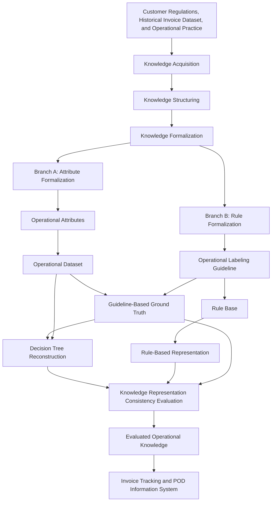

# Research Positioning Statement

## 1. Research Identity

This research is an integration of Knowledge Engineering, Decision Support System, Information System, Software Engineering, and Machine Learning, but its primary scientific contribution is in Knowledge Engineering. More specifically, the center of the thesis is the Operational Knowledge Formalization Framework for invoice delivery priority. The thesis is not primarily a study about inventing, optimizing, or ranking machine-learning algorithms. It is a study about how operational knowledge in invoice delivery administration can be acquired, structured, formalized, represented, reconstructed, evaluated for consistency, and embedded into a decision-support information system.

The operational domain is invoice tracking and Proof of Delivery (POD). The system domain is a web-based information system that records invoice movement, POD evidence, and delivery status. The decision-support domain is invoice delivery priority recommendation: HIGH, MEDIUM, or NORMAL. The machine-learning component is Decision Tree C4.5, but it is not the center of the contribution. It is used as an interpretable data-driven mechanism to reconstruct formalized operational knowledge from structured operational attributes and Guideline-Based Ground Truth.

The central discipline is Knowledge Engineering because the research begins with tacit and procedural operational knowledge, such as customer cut-off regulations, receiving schedules, administrative timing constraints, and staff prioritization practice. This knowledge is transformed through a framework consisting of Knowledge Acquisition, Knowledge Structuring, Attribute Formalization, Rule Formalization, Operational Labeling Guideline construction, Knowledge Representation, Knowledge Reconstruction, and Knowledge Representation Consistency Evaluation. Rule-Based reasoning is therefore not merely a competing algorithm. It is the explicit representation of the formalized operational knowledge. Decision Tree C4.5 is not used as a superior predictor. It is used to test whether the same formalized operational structure can be reconstructed from data.

Software Engineering and Information System contributions are secondary but necessary. They provide the system context in which the knowledge artifacts can be used: invoice records, POD storage, tracking history, and priority recommendation. Decision Support System is also secondary but important because the final system output supports operational action rather than replacing human administrative responsibility. Machine Learning is supportive because it provides an interpretable reconstruction mechanism and feature-dominance analysis.

Therefore, the research identity is: a Knowledge Engineering study that proposes an Operational Knowledge Formalization Framework for invoice delivery priority, applies it in the domain of invoice tracking and POD, evaluates it through Rule-Based representation and Decision Tree reconstruction, and positions the result within an Information System for operational decision support.

## 2. Research Problem

The research solves three connected problems: an operational problem, a knowledge problem, and a system problem.

The operational problem is that invoice delivery priority is influenced by customer-specific regulations, cut-off rules, receiving schedules, POD availability, and administrative timing. When these factors are handled manually or semi-manually, staff must rely on memory, experience, and scattered records. This can create inconsistent priority decisions, slow invoice handling, difficult audit trails, and delayed administrative processing.

The knowledge problem is that the rules behind priority decisions are partly tacit. They exist in practice, customer regulations, spreadsheet habits, and staff interpretation, but they are not fully expressed as formal decision logic. Without formalization, the organization cannot consistently explain why an invoice should be HIGH, MEDIUM, or NORMAL priority. The central knowledge problem is therefore not simply "how to predict priority", but how to transform operational knowledge into a stable reference structure that can produce formal attributes, explicit rules, guideline-based labels, and interpretable representations.

The system problem is that invoice status, POD evidence, tracking history, and priority recommendation need to be connected in one information system context. A system that only stores invoices does not solve the knowledge problem. A model that only outputs labels does not solve the tracking and audit problem. The research addresses both by positioning operational priority knowledge as part of the invoice tracking and POD workflow.

Algorithms come after these problems. Rule-Based and Decision Tree C4.5 are selected because they provide two interpretable ways to represent and reconstruct the same formalized operational knowledge.

## 3. Research Contributions

### Primary Contribution

The primary contribution is the Operational Knowledge Formalization Framework for invoice delivery priority. This framework transforms tacit and procedural operational knowledge into two interpretable representations that can be evaluated through representation consistency. The framework consists of the following process chain:

```text
Knowledge Acquisition
-> Knowledge Structuring
-> Attribute Formalization
-> Rule Formalization
-> Operational Labeling Guideline
-> Knowledge Representation
-> Knowledge Reconstruction
-> Knowledge Representation Consistency Evaluation
```

This matters because it elevates the thesis beyond a model-performance comparison. The scientific issue is not whether Rule-Based or Decision Tree is "better". The scientific issue is whether operational knowledge can be transformed into formal artifacts that preserve the same operational meaning across explicit knowledge-driven representation and interpretable data-driven reconstruction.

The primary artifact produced by this contribution is the framework itself, expressed through its process flow and its resulting artifacts: formalized operational attributes, Rule Base, Operational Labeling Guideline, Guideline-Based Ground Truth, Rule-Based representation, Decision Tree reconstruction, and evaluation report. The contribution is validated by showing consistency between the two representations of the same formalized operational knowledge.

### Secondary Contributions

The first secondary contribution is an operational dataset built from invoice records and formalized customer-administration attributes. This matters because the dataset is not only historical data; it is a structured operational knowledge artifact. It is validated through dataset checks, label validity checks, duplicate checks, and train-test class representation.

The second secondary contribution is the explicit Rule-Based representation of invoice priority knowledge. This matters because it preserves traceability and auditability. It is validated through agreement with the Guideline-Based Ground Truth and through rule activation analysis.

The third secondary contribution is the Decision Tree reconstruction of the formalized knowledge. This matters because it tests whether a data-driven interpretable model can recover the operational decision structure without receiving the Rule Base directly. It is validated through metric agreement, tree-path analysis, and feature importance.

The fourth secondary contribution is the invoice tracking and POD information-system design. This matters because the decision artifacts are placed in an operational information-system context. It is validated through system design artifacts such as architecture, use case diagram, activity diagram, and ERD.

## 4. Research Processes and Research Artifacts

This thesis distinguishes research processes from research artifacts. A process is an activity or method performed by the researcher. An artifact is an output, object, structure, model, dataset, or report produced or used by those processes. This distinction is mandatory because the thesis contribution is not a single model, table, or system screen. The contribution is the controlled transformation from operational knowledge sources into formal artifacts and then into two interpretable representations.

### 4.1 Research Processes

| Process | Purpose | Input | Output | Related artifacts |
|---|---|---|---|---|
| Knowledge Acquisition | Extract operational knowledge from the invoice administration domain. | Customer regulations, historical invoice practice, receiving schedules, POD workflow, staff operational knowledge. | Collected operational decision concepts and constraints. | Customer Regulations, Historical Invoice Dataset, Operational Knowledge Repository. |
| Knowledge Structuring | Organize acquired knowledge into decision-relevant categories. | Acquired operational concepts. | Structured knowledge categories such as cut-off timing, receiving schedule, month-end condition, POD relevance, and urgency level. | Operational Knowledge Repository. |
| Attribute Formalization | Convert operational concepts into computable features. | Structured knowledge categories and invoice records. | Operational attributes such as `days_to_cutoff_decision_time`, `receive_day_code`, `receive_schedule`, and `next_receive_day_gap_feature`. | Operational Attributes, Operational Dataset. |
| Rule Formalization | Convert structured operational conditions into explicit decision rules. | Structured knowledge categories and formalized attributes. | Rule conditions, priority consequences, and conflict-resolution logic. | Rule Base, Operational Labeling Guideline. |
| Knowledge Representation | Represent formalized operational knowledge explicitly. | Rule Base and formalized operational attributes. | Rule-Based representation of priority logic. | Rule-Based Representation, Rule Base. |
| Knowledge Reconstruction | Reconstruct formalized knowledge statistically from data. | Operational Dataset and Guideline-Based Ground Truth. | Decision Tree paths and feature-importance structure. | Decision Tree Model, Decision Tree Reconstruction. |
| Knowledge Representation Consistency Evaluation | Evaluate whether both representations preserve the same operational meaning. | Rule-Based output, Decision Tree output, Guideline-Based Ground Truth, tree paths, rule mappings. | Consistency metrics, interpretation, limitations, and evaluation report. | Evaluation Report, confusion matrices, feature importance, rule usage statistics. |
| System Embedding | Place evaluated knowledge into a practical decision-support context. | Evaluated priority logic and system requirements. | Invoice tracking and POD information-system design. | Invoice Tracking and POD Information System. |

### 4.2 Research Artifacts

| Artifact | Purpose | Input | Output | Relationship with processes |
|---|---|---|---|---|
| Customer Regulations | Provide formal and semi-formal business rules about invoice receiving and cut-off. | Customer administrative policies. | Domain constraints. | Source artifact for Knowledge Acquisition. |
| Historical Invoice Dataset | Provide empirical operational cases. | Invoice records from the study context. | Historical invoice cases. | Source artifact for Attribute Formalization and Operational Dataset construction. |
| Operational Knowledge Repository | Store acquired and structured operational decision knowledge. | Customer regulations, staff practice, invoice handling routines. | Organized operational knowledge. | Output of Knowledge Acquisition and Knowledge Structuring; input to formalization. |
| Operational Attributes | Make operational knowledge computable. | Structured operational knowledge and invoice records. | Formal attributes used by rules and Decision Tree. | Output of Attribute Formalization. |
| Operational Labeling Guideline | Define the procedure for assigning invoice priority labels. | Formalized attributes and operational rules. | Labeling procedure for HIGH, MEDIUM, and NORMAL. | Output of Rule Formalization; source for Guideline-Based Ground Truth. |
| Guideline-Based Ground Truth | Serve as the reference label for consistency evaluation. | Operational Labeling Guideline and Operational Dataset. | Reference priority labels, implemented as `final_label`. | Used by Rule-Based evaluation and Decision Tree training/testing. |
| Operational Dataset | Store formalized operational cases for modeling and evaluation. | Historical invoice records and Operational Attributes. | Dataset with features and Guideline-Based Ground Truth. | Output of Attribute Formalization; input to reconstruction and evaluation. |
| Rule Base | Represent formalized operational knowledge as IF-THEN rules. | Rule Formalization and Operational Labeling Guideline. | Explicit operational rules. | Input to Rule-Based Representation. |
| Rule-Based Representation | Apply the Rule Base as explicit knowledge representation. | Rule Base and Operational Dataset. | Rule-Based priority output and activated rule evidence. | Output of Knowledge Representation. |
| Decision Tree Model | Reconstruct operational knowledge from structured attributes. | Operational Dataset and Guideline-Based Ground Truth. | Tree paths and feature importance. | Output of Knowledge Reconstruction. |
| Invoice Tracking and POD Information System | Provide an operational context for using the priority recommendation. | System requirements, invoice workflow, POD workflow, evaluated priority logic. | System design artifacts and decision-support context. | Output of System Embedding. |
| Evaluation Report | Explain representation consistency and limitations. | Rule-Based output, Decision Tree output, metrics, tree paths, feature importance, rule usage. | Scientific interpretation of consistency and reconstruction. | Output of Knowledge Representation Consistency Evaluation. |

### 4.3 Relationship Between Processes and Artifacts

The processes define how knowledge moves through the research. The artifacts define what is produced, consumed, or evaluated at each stage. For example, Knowledge Acquisition is a process; Customer Regulations and Historical Invoice Dataset are artifacts used by that process. Attribute Formalization is a process; Operational Attributes and Operational Dataset are artifacts produced by it. Rule Formalization is a process; Rule Base and Operational Labeling Guideline are artifacts produced by it.

This separation prevents two common ambiguities. First, it prevents treating Rule-Based or Decision Tree as the thesis contribution by themselves. They are artifacts and representation mechanisms inside the larger Operational Knowledge Formalization Framework. Second, it prevents treating accuracy as the main research result. Accuracy is one indicator inside the Evaluation Report, whose purpose is Knowledge Representation Consistency Evaluation.

## 5. Scientific Positioning

This research is a Knowledge Engineering study applied to invoice tracking and POD administration. It studies how operational knowledge can be transformed from tacit or procedural form into explicit, computable, and evaluable decision structures. Its primary contribution is the Operational Knowledge Formalization Framework, not the Rule-Based model or Decision Tree model as isolated methods.

This research is also a Decision Support System study because the output supports invoice delivery prioritization. It is an Information System and Software Engineering study because the knowledge artifacts are placed in a web-based tracking and POD system design. It uses Machine Learning, but only as one component in the reconstruction and consistency evaluation of formalized operational knowledge.

This research is not intended to discover a new machine-learning algorithm. It is not intended to optimize Decision Tree C4.5. It is not intended to compare algorithm superiority. It is not intended to maximize predictive accuracy as the main scientific claim. It is not intended to prove that Decision Tree is better than Rule-Based reasoning.

The actual scientific positioning is: operational knowledge can be formalized into a framework that produces two interpretable representations, namely Rule-Based representation and Decision Tree reconstruction. These representations are then evaluated through Knowledge Representation Consistency Evaluation, which measures whether they preserve the same operational meaning rather than which paradigm is superior.

## 6. Philosophical Position

The epistemological position of this research is that operational knowledge exists before data modeling. In invoice administration, staff do not begin with algorithms; they begin with customer rules, cut-off schedules, receiving windows, POD requirements, and practical judgments about urgency. These forms of knowledge may be tacit, scattered, or inconsistently documented, but they already shape operational decisions before any model is trained.

Knowledge Acquisition extracts this pre-existing operational knowledge from regulations, records, and practice. Knowledge Formalization then structures it into computable attributes, explicit rules, and a labeling guideline. In this view, the Operational Dataset is not neutral raw data; it is data that has been shaped by prior operational meaning. The Guideline-Based Ground Truth is also not an independent natural fact. It is a reference decision produced from the formalized operational guideline.

Rule-Based reasoning exists in the thesis because it explicitly represents the formalized knowledge. It preserves the administrative meaning of rules in a form that can be inspected and audited. Decision Tree C4.5 exists for a different reason: it statistically reconstructs the same formalized knowledge from structured attributes and guideline-based labels. Its value is not that it replaces the Rule Base, but that it tests whether the formalized operational meaning is recoverable from data.

Knowledge Representation Consistency Evaluation then determines whether the explicit representation and statistical reconstruction preserve the same operational meaning. This is why the Decision Tree is scientifically necessary: it provides reconstruction evidence, feature-dominance insight, and a second interpretable representation of the same knowledge. The epistemological claim is therefore not "the data discovers the knowledge", but "formalized operational knowledge can be represented explicitly and reconstructed statistically while preserving meaning."

## 7. Why Rule-Based?

Rule-Based is necessary because the domain contains explicit operational constraints. Customer cut-off dates, receiving schedules, month-end conditions, limited receiving days, and no-cutoff cases are not merely statistical patterns. They are administrative rules that staff must follow. A Rule-Based representation preserves these rules in a form that can be inspected, audited, explained, and updated.

Rule-Based is therefore not simply another competing algorithm. It is the explicit Knowledge Representation artifact produced by the Operational Knowledge Formalization Framework. It expresses the formalized guideline as IF-THEN logic and makes each priority recommendation traceable to a rule or rule group. This is essential in invoice administration because users need to know why a document is urgent, not only what label a model assigns.

Its role is to represent the formalized operational meaning directly. Perfect agreement with the Guideline-Based Ground Truth should be interpreted as consistency between the guideline and its explicit rule implementation, not as independent proof of universal predictive correctness.

## 8. Why Decision Tree?

Decision Tree C4.5 is used because it provides an interpretable data-driven structure. It can learn decision paths from structured operational attributes and Guideline-Based Ground Truth, while still producing a tree that can be inspected by humans. This makes it suitable for reconstruction analysis.

The purpose of Decision Tree is to reconstruct formalized operational knowledge from data. It does not receive the Rule Base directly. Instead, it receives attributes such as `days_to_cutoff_decision_time`, `receive_day_code`, `receive_schedule`, and `next_receive_day_gap_feature`, then forms decision paths that can be mapped back to the Rule-Based structure.

Interpretability is more important than predictive competition because the thesis must explain the relationship between operational knowledge and model behavior. Feature importance and tree paths help identify which formalized attributes dominate reconstruction. This supports knowledge analysis and consistency evaluation, not algorithm superiority.

## 9. Relationship Between Both Approaches

Rule-Based and Decision Tree are not competitors in the central scientific argument. They represent two different paradigms applied to the same formalized operational knowledge.

Rule-Based is knowledge-driven. It starts from Rule Formalization and the Operational Labeling Guideline, then represents decision logic explicitly. Its strength is traceability, auditability, and maintainability when operational rules change.

Decision Tree is data-driven. It starts from Operational Attributes, Operational Dataset, and Guideline-Based Ground Truth, then reconstructs decision paths through statistical learning. Its strength is showing whether the formalized knowledge has a stable pattern that can be recovered from data.

Both are needed because each answers a different scientific question. Rule-Based answers: "Can the operational knowledge be represented explicitly and consistently?" Decision Tree answers: "Can the same formalized knowledge be reconstructed from structured operational data?" Their comparison is therefore a Knowledge Representation Consistency Evaluation, not a contest for model superiority.

## 10. Core Research Pipeline



The pipeline separates two formalization branches. Branch A formalizes attributes and produces the operational dataset used for Guideline-Based Ground Truth and Decision Tree reconstruction. Branch B formalizes rules and produces the Operational Labeling Guideline, Rule Base, and Rule-Based representation. The branches converge in Knowledge Representation Consistency Evaluation, where the research examines whether the Rule-Based representation and Decision Tree reconstruction preserve the same operational meaning. The evaluated knowledge is then embedded into the Invoice Tracking and POD Information System.

## 11. Core Scientific Claim

This thesis demonstrates that operational knowledge for invoice delivery priority can be transformed through an Operational Knowledge Formalization Framework that begins with Knowledge Acquisition and Knowledge Structuring, continues through Attribute Formalization and Rule Formalization, produces an Operational Labeling Guideline and Guideline-Based Ground Truth, and generates two interpretable representations: Rule-Based representation and Decision Tree reconstruction. The scientific contribution is not the superiority of one algorithm or the achievement of maximum predictive accuracy, but the demonstration that tacit operational knowledge can be formalized into artifacts whose operational meaning is preserved across explicit knowledge-driven representation and interpretable data-driven reconstruction. The evaluation therefore measures Knowledge Representation Consistency through agreement with Guideline-Based Ground Truth, traceability of rules, feature dominance, and alignment between tree paths and operational rules within the bounded invoice tracking and POD context.

## 12. Defense Position

| Question | Concise answer |
|---|---|
| Why not only Rule-Based? | Rule-Based shows explicit representation and operational traceability, but it does not test whether the formalized knowledge structure can be reconstructed from data. Decision Tree adds reconstruction evidence and feature-dominance analysis. |
| Why not only Decision Tree? | Decision Tree can learn paths, but without the Operational Labeling Guideline and Rule-Based representation, the source and meaning of the labels would be unclear. The research needs explicit knowledge representation before reconstruction. |
| Why compare both? | The comparison evaluates two representations of the same formalized knowledge: knowledge-driven representation and data-driven reconstruction. It is not a competition for superiority. |
| Why is 100% accuracy not the contribution? | Because the labels are guideline-based, 100% agreement means consistency with Guideline-Based Ground Truth in the final dataset. It does not prove universal generalization or independent real-world correctness. |
| What is the novelty? | The novelty is the Operational Knowledge Formalization Framework that transforms tacit operational invoice-priority knowledge into two interpretable representations, then evaluates whether both preserve the same operational meaning through Knowledge Representation Consistency Evaluation inside an invoice tracking and POD context. |

## 13. Consistency Rules

Every future chapter revision must follow these rules:

1. Do not claim Decision Tree is superior to Rule-Based.
2. Do not claim Rule-Based is merely another competing algorithm.
3. Do not interpret 100% accuracy as proof of external generalization.
4. Do not present Ground Truth without qualification when ambiguity may occur; use Guideline-Based Ground Truth or Ground Truth (Guideline-Based).
5. Always distinguish Operational Labeling Guideline, Rule Base, Guideline-Based Ground Truth, Decision Tree Reconstruction, and Operational Recommendation.
6. Maintain the distinction between prediction as model output and priority recommendation as system output.
7. Use "agreement", "representation consistency", or "Knowledge Representation Consistency Evaluation" when interpreting metrics against Guideline-Based Ground Truth.
8. State that Rule-Based represents formalized operational knowledge explicitly.
9. State that Decision Tree reconstructs formalized operational knowledge from structured operational attributes.
10. Interpret feature importance as reconstruction attribute dominance, not causal proof.
11. Explain zero-importance operational features as possibly redundant within the learned tree, not necessarily irrelevant to operations.
12. Keep the system contribution secondary to the Operational Knowledge Formalization Framework.
13. Keep Machine Learning as a supporting reconstruction method, not the thesis identity.
14. Preserve the bounded validity of the findings: dataset size, customer-specific rules, guideline-based labels, and limited external generalization.
15. Make Chapter IV support the core scientific claim through evidence, not through algorithm-ranking language.
16. Make Chapter V, if later created or revised, conclude the Operational Knowledge Formalization Framework, not Decision Tree performance.

## 14. Consistency Checklist Before Thesis Revision

Use this checklist before revising each thesis chapter.

- [ ] Does Chapter I describe Knowledge Engineering as the primary contribution?
- [ ] Does Chapter I position the Operational Knowledge Formalization Framework as the core contribution?
- [ ] Does Chapter I avoid presenting the research as a contest between Rule-Based and Decision Tree?
- [ ] Does Chapter I separate the operational problem, knowledge problem, and system problem?
- [ ] Does Chapter II support Knowledge Acquisition, Knowledge Structuring, Knowledge Formalization, Knowledge Representation, and Knowledge Reconstruction?
- [ ] Does Chapter II explain Decision Tree interpretability as a reason for reconstruction analysis rather than predictive competition?
- [ ] Does Chapter III distinguish research processes from research artifacts?
- [ ] Does Chapter III distinguish Attribute Formalization from Rule Formalization?
- [ ] Does Chapter III explain how the Operational Labeling Guideline produces Guideline-Based Ground Truth?
- [ ] Does Chapter III preserve the distinction between prediction as model output and priority recommendation as system output?
- [ ] Does Chapter IV interpret accuracy as representation consistency instead of predictive superiority?
- [ ] Does Chapter IV explain why Rule-Based agreement is expected under Guideline-Based Ground Truth?
- [ ] Does Chapter IV explain why Decision Tree reconstruction does not imply discovery of new operational knowledge?
- [ ] Does Chapter IV map Decision Tree paths back to the Rule Base or formalized operational meaning?
- [ ] Does Chapter IV interpret feature importance as reconstruction attribute dominance, not causal proof?
- [ ] Does Chapter IV explicitly state limitations related to dataset size, customer-specific rules, and guideline-based labels?
- [ ] Does Chapter V conclude the Operational Knowledge Formalization Framework rather than Decision Tree performance?
- [ ] Does Chapter V avoid claiming generalization beyond the studied operational context?
- [ ] Are terms such as Guideline-Based Ground Truth, Rule Base, Rule-Based Representation, Decision Tree Reconstruction, and Priority Recommendation used consistently?
- [ ] Are all claims about 100% accuracy bounded to the final dataset and consistency-evaluation context?

## 15. Summary of Changes

The following refinements were made to strengthen the scientific positioning document:

1. Separated research processes from research artifacts. This removes ambiguity between what the researcher does and what the research produces.
2. Elevated the Operational Knowledge Formalization Framework as the primary scientific contribution. This prevents the thesis from appearing to contribute only Rule-Based or Decision Tree models.
3. Expanded the framework into a clear process chain: Knowledge Acquisition, Knowledge Structuring, Attribute Formalization, Rule Formalization, Operational Labeling Guideline, Knowledge Representation, Knowledge Reconstruction, and Knowledge Representation Consistency Evaluation.
4. Replaced the previous linear pipeline with a two-branch Mermaid pipeline. This clarifies that Attribute Formalization and Rule Formalization are distinct branches that converge during consistency evaluation.
5. Standardized the evaluation perspective as Knowledge Representation Consistency Evaluation. This clarifies that the evaluation measures consistency between representations of the same knowledge, not paradigm superiority.
6. Added a Philosophical Position section. This explains that operational knowledge exists before data modeling and that Decision Tree exists to reconstruct formalized knowledge, not to discover or replace it.
7. Clarified novelty. The novelty is now defined as the Operational Knowledge Formalization Framework that transforms tacit operational knowledge into two interpretable representations evaluated through consistency.
8. Refined terminology around labels. The document now prefers Guideline-Based Ground Truth or Ground Truth (Guideline-Based) where ambiguity may occur.
9. Preserved the distinction between prediction as model output and priority recommendation as system output.
10. Added a chapter-level consistency checklist. This gives a verifiable tool for checking Chapters I-V before and after revision.
11. Strengthened defense answers. The defense position now emphasizes framework contribution, representation consistency, and bounded interpretation of 100% accuracy.
12. Preserved the original research scope. No new algorithms, datasets, experiments, figures, tables, or thesis-title changes were introduced.
